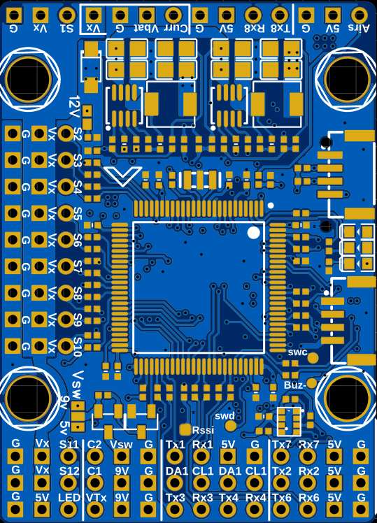

# ElfinH7-Wing Flight Controller

## Features

 - MCU - STM32H750 32-bit processor running at 480 MHz
 - 16MByte Serial NOR flash via QuadSPI
 - Barometer - spl06-001 on I2C1 bus
 - IMUs - 1x icm-42688-p, 1x icm-20608-g

## Interface

 - 7x UARTs (1,2,3,4,6,7,8)
 - 13x PWM Outputs (12 Motor Output, 1 LED)
 - 1x RC input PWM/PPM, SBUS
 - 2x I2C port for external compass, airspeed sensor, etc.
 - SPI4 port
 - USB port (with remote cabling)
 - CAN port
 - External Buzzer
 - Dual Switchable Camera inputs
 - Built-in OSD
- microSD card
- Battery input voltage: 2S-6S
 - BEC: 1x 5V/2A, 1x 9/12V/2A, 1x 5/6/7.2V/12A

## Pinout

## UART Mapping

The UARTs are marked Rn and Tn in the above pinouts. The Rn pin is the
receive pin for UARTn. The Tn pin is the transmit pin for UARTn.

 - SERIAL0 -> USB
 - SERIAL1 -> UART1 (Telem1)
 - SERIAL2 -> UART2 (Telem2)
 - SERIAL3 -> UART3 (GPS)
 - SERIAL4 -> UART4 (GPS)
 - SERIAL5 -> UART6 (RCIN one wire, DMA-enabled)
 - SERIAL6 -> UART7
 - SERIAL8 -> UART8

## RC Input

RC input is configured on the R6 (UART6_RX) pin. It supports all serial RC protocols. For protocols requiring half-duplex serial to transmit telemetry (such as FPort) you should setup SERIAL5 as an RC input serial port,
with half-duplex, pin-swap and inversion enabled.

## OSD Support

The ElfinH7-Wing supports OSD using OSD_TYPE 1 (MAX7456 driver).

## PWM Output

The ElfinH7-Wing supports up to 13 PWM outputs. The pads for motor output M1 to M12 on the motor connectors , plus M13 for LED strip or another PWM output. 

The PWM is in 5 groups:

 - PWM 1-4     in group1
 - PWM 5-8     in group2
 - PWM 9,10   in group3
 - PWM 11,12 in group4
 - PWM 13      in group5

Channels within the same group need to use the same output rate. If any channel in a group uses DShot then all channels in the group need to use DShot. Channels 1-4 support bi-directional dshot.

## Battery Monitoring

The board has a builting voltage and current sensor. The current sensor can read up to 130 Amps. The voltage sensor can handle up to 6S LiPo batteries.

The correct battery setting parameters are:

 - BATT_MONITOR 4
 - BATT_VOLT_PIN 10
 - BATT_CURR_PIN 11
 - BATT_VOLT_MULT 11.1
 - BATT_AMP_PERVLT 59.5

## Compass

The ElfinH7-Wing does not have a builtin compass, but you can attach an external compass using I2C on the SDA and SCL pads.

## Loading Firmware

Since this board stores the flight control software on external flash the initial firmware load should be done using the
SPRacing SSBL (https://github.com/spracing/ssbl). Please follow the instructions for loading PX4 firmware to load ArduPilot.
A convenience script is provided Tools/scripts/ssbl_uploader.sh to perform the required steps.
It should also be possible to load the ArduPilot bootloader via DFU, but doing so will invalidate your warranty.
